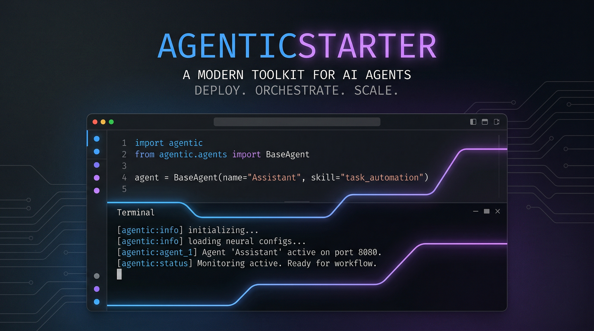

<p align="center">
  
</p>

# AgenticStarter

Skip the boilerplate. AgenticStarter is a CLI that scaffolds a complete micro-SaaS project for your agentic tool — project structure, landing page, and an MCP server — in one command.

Built for solo developers who have a working agent and want to ship it as a product.

## Install

```bash
git clone https://github.com/m2ai-portfolio/agenticstarter.git
cd agenticstarter
pip install -e .
```

Requires Python 3.11+. No external services needed.

## What You Get

**Project scaffold** — Standard Python package layout with `pyproject.toml`, `src/`, `tests/`, and a CLI entry point. Ready for `pip install -e .` out of the box.

**Landing page generator** — Static HTML with responsive layout, meta tags, and a call-to-action button. Input sanitized against XSS. One command, one file, no framework.

**MCP server** — Minimal JSON-RPC 2.0 server with tool registration. Extend it by plugging in your own handlers:

```python
from agenticstarter.mcp_server import MCPServer

server = MCPServer(host="localhost", port=8000)
server.register_tool("summarize", my_summarize_handler)
server.start(blocking=True)
```

## Usage

```bash
# Scaffold a new project
agenticstarter init --name "my-agent" --path ./projects

# Generate a landing page
agenticstarter landing-page --name "My Agent" --desc "Automates X for Y" --output ./site

# Start the MCP server
agenticstarter mcp-server start --host localhost --port 8000
```

## Project Structure

```
agenticstarter/
  cli.py                    # Click CLI (init, landing-page, mcp-server)
  project_template.py       # Project scaffold generator
  landing_page_template.py  # HTML landing page generator
  mcp_server.py             # JSON-RPC 2.0 MCP server
  deployment_instructions.md
tests/
  test_project_scaffold.py
  test_landing_page.py
  test_mcp_server.py
```

## Testing

```bash
pip install -e ".[dev]"
pytest tests/ -v
```

## License

MIT
