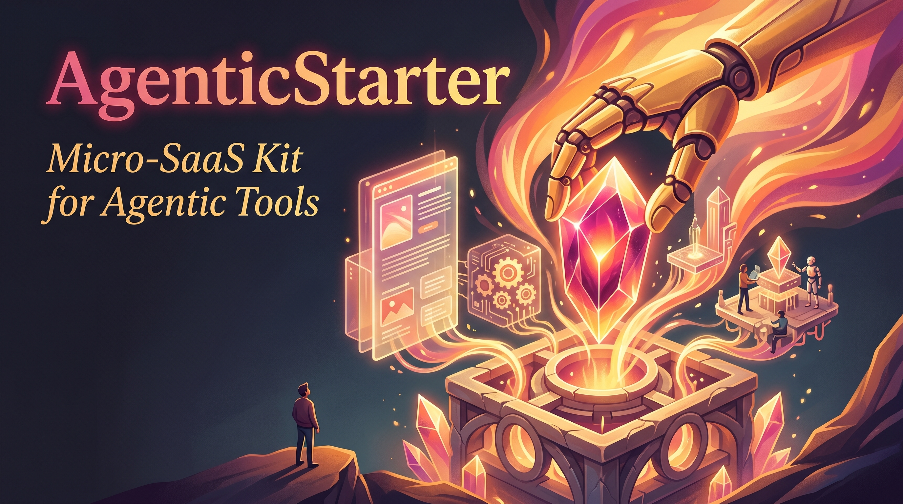

<p align="center">
  
</p>

<h3 align="center">A starter kit (template + CLI) that generates a micro-SaaS project for an agentic tool, including a landing page (via prompt-to-app), an MCP server for core functionality, extensibility via agentic execution embed, and deployment instructions for solo developers.</h3>

<p align="center">
  <a href="#quick-start">Quick Start</a> &bull;
  <a href="#features">Features</a> &bull;
  <a href="#examples">Examples</a> &bull;
  <a href="#contributing">Contributing</a>
</p>

## What is this?
AgenticStarter is a CLI‑driven template that helps solo AI developers turn an existing agentic tool or MCP server into a sellable micro‑SaaS. It scaffolds a project, creates a landing page, and provides a minimal MCP server ready for extension.

```
$ agenticstarter init my-agentic-tool
Created project my-agentic-tool/
  pyproject.toml
  src/
  tests/
```

## Problem
Solo developers who build agentic tools struggle with the boilerplate of creating a sellable product (landing page, auth, payments, deployment), causing them to abandon monetization efforts despite having useful tools.

## Features
| Feature | Description |
|---------|-------------|
| Project Scaffold | Generates a ready‑to‑use micro‑SaS layout with pyproject.toml, src/ package, and tests/ directory via `agenticstarter init`. |
| Landing Page Creator | Produces a static HTML landing page from a product name and description using `agenticstarter landing-page`. |
| MCP Server | Implements a basic JSON‑RPC 2.0 Model Context Protocol server with agentic execution embed support, listening on localhost:8000. |
| CLI Entrypoint | Provides a Click‑based command line interface with subcommands `init`, `landing-page`, `mcp-server`. |
| Deployment Guide | Includes a markdown file with step‑by‑step instructions for deploying the generated micro‑SaaS to common platforms. |

## Quick Start
1. Clone the repository:  
   ```bash
   git clone https://github.com/m2ai-portfolio/AgenticStarter.git
   cd AgenticStarter
   ```
2. Install the package in editable mode:  
   ```bash
   pip install -e .
   ```
3. Scaffold a new micro‑SaaS project:  
   ```bash
   agenticstarter init my-agentic-tool
   ```
   This creates a folder `my-agentic-tool/` with the required structure.

## Examples
**Initialize a new project**  
```
$ agenticstarter init my-agentic-tool
Created project my-agentic-tool/
  pyproject.toml
  src/
  tests/
```

**Generate a landing page**  
```
$ agenticstarter landing-page --name "DocuSage" --desc "AI‑powered contract reviewer"
Generated index.html:
<!DOCTYPE html>
<html>
<head><title>DocuSage</title></head>
<body>
  <h1>DocuSage</h1>
  <p>AI‑powered contract reviewer</p>
  <button>Get Started</button>
</body>
</html>
```

**Start the MCP server**  
```
$ agenticstarter mcp-server start
MCP server listening on http://localhost:8000
→ Received ping, responding with pong
```

## File Structure
```
AgenticStarter: Micro-SaaS Kit for Agentic Tools/
  agenticstarter/          # Core source code
    cli.py                 # Click CLI entrypoint (init, landing-page, mcp-server)
    project_template.py    # Logic for scaffolding a new project
    landing_page_template.py # Function to render HTML landing page
    mcp_server.py          # Minimal MCP server with JSON‑RPC 2.0 support
  tests/                   # Test suite
    test_cli.py
    test_landing_page.py
    test_mcp_server.py
    test_project_template.py
  assets/                  # Static graphics (infographic, etc.)
  screenshots/             # Demo images and verification outputs
  pyproject.toml           # Project metadata, dependencies, and entry points
  README.md
```

## Tech Stack
| Technology | Purpose |
|------------|---------|
| Python 3.11+ | Core language runtime |
| click | Building the CLI interface |
| pytest | Running unit and integration tests |

## Contributing
1. Fork the repository.  
2. Create a feature branch.  
3. Make changes and run `pytest` to verify.  
4. Submit a pull request.

## License
MIT

## Author
Matthew Snow -- [M2AI](https://m2ai.co) | [@m2ai-portfolio](https://github.com/m2ai-portfolio)